### Matplotlib 기본
>Matplotlib는 파이썬에서 자료를 차트(chart)나 플롯(plot)으로 시각화(visulaization)하는 패키지이다. Matplotlib는 다음과 같은 정형화된 차트나 플롯 이외에도 저수준 api를 사용한 다양한 시각화 기능을 제공한다.-[데이터 사이언스 스쿨](https://datascienceschool.net/view-notebook/d0b1637803754bb083b5722c9f2209d0/)
- 라인 플롯(line plot)
- 스캐터 플롯(scatter plot)
- 컨투어 플롯(contour plot)
- 서피스 플롯(surface plot)
- 바 차트(bar chart)
- 히스토그램(histogram)
- 박스 플롯(box plot)
Matplotlib를 사용한 시각화 예제들을 보고 싶다면 [다음 웹사이트](http://matplotlib.org/gallery.html)를 방문한다.

[소스코드](../Day_02_03_matplotlib.py)
#### graph01
```python
plt.plot([10, 20, 30, 40 ,50])
plt.show()
```
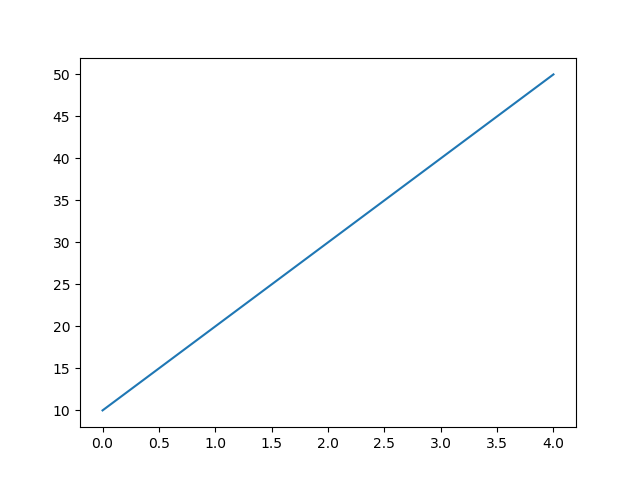

#### graph02
xlim, ylim 설정을 통해 x,y 범위 limit 지정
```python
plt.plot([1,2,3,4], [1, 4, 9, 16], 'ro')        # ro # 선 대신 특정 점 찍을 때
plt.xlim(0, 5)
plt.ylim(0, 20)
plt.show()
```
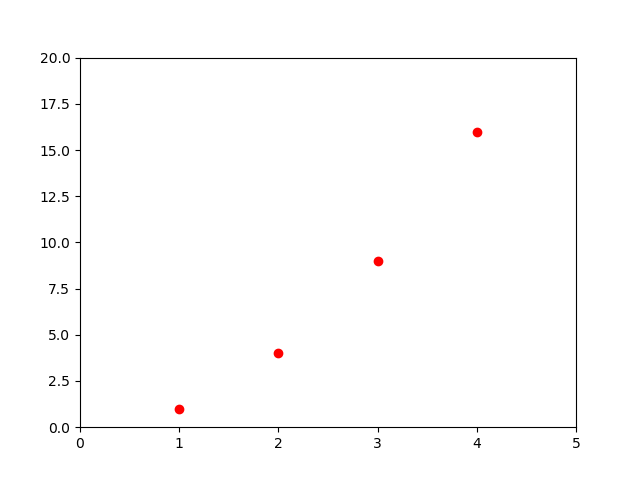

#### graph03
```python
# x 범위가 -10 ~ 10일 때의 x^2에 대한 그래프
a = np.arange(-10,10, 0.1)
plt.plot(a, a**2)
plt.show()
```
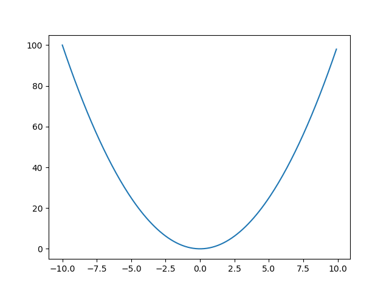

#### graph04
marker 의 사용
```python
x = np.linspace(-10, 10, 100)
y = np.sin(x)

#plt.plot(x, y)
#plt.plot(x, y, 'rx')
plt.plot(x, y, marker='x')
plt.show()
```
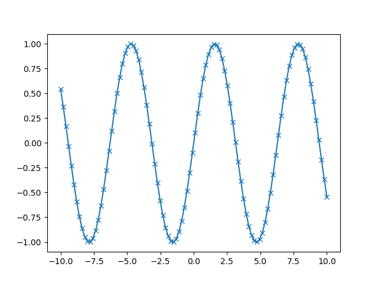

#### graph05
```python
# 로그 곡선 4개를 하나의 피겨에 그려 보세요.
fig, ax = plt.subplots()
ax.grid(True)               # 격자 무늬

a = np.arange(0.01, 2, 0.01)

plt.plot(a, np.log(a))
plt.plot(a, -np.log(a))

a2 = np.arange(0.01-2, 0, 0.01)

plt.plot(a2, np.log(-a2))
plt.plot(a2, -np.log(-a2))
plt.show()
```
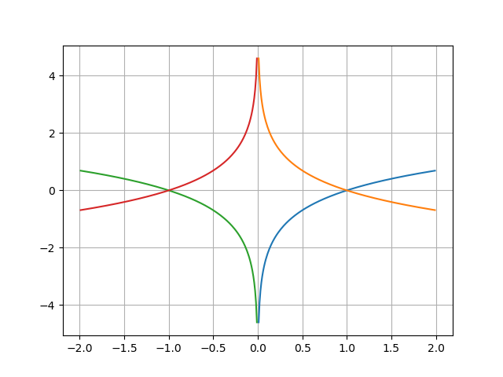

#### graph06
```python
def func(t):
    return np.exp(-t) * np.cos(2*np.pi * t)

t1 = np.arange(0, 5 ,0.1)
t2 = np.arange(0, 5 ,0.02)

plt.figure(1)
plt.subplot(2,1,1)
plt.plot(t1, func(t1))
plt.subplot(2,1,2)
plt.plot(t2, func(t2))

plt.figure(2)
plt.plot(t2, np.cos(2 * np.pi * t2), 'r--')
plt.show()
```
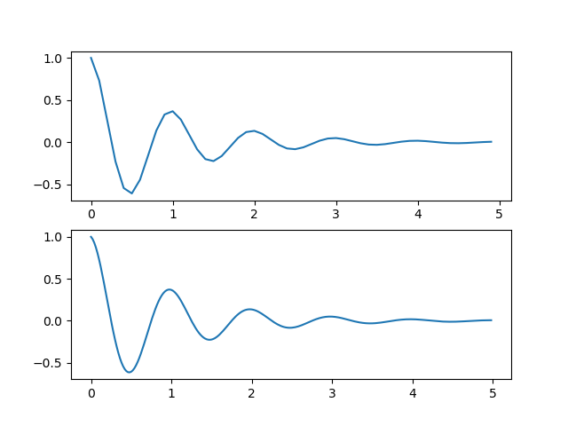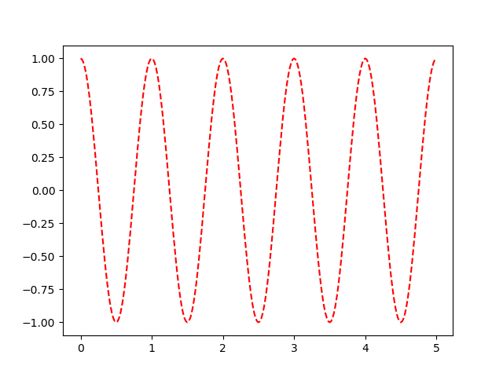

#### graph07
```python
# 로그 곡선 4 개를 2 개의 피겨에 그려 보세요.
fig, ax = plt.subplots()
ax.grid(True)

fig = plt.figure(1)
a = np.arange(0.01, 2, 0.01)
plt.subplot(2,1,1)

fig.gca().grid(True)                # gca() - current axes 반환
plt.plot(a, np.log(a))
plt.subplot(2, 1, 2)
fig.gca().grid(True)
plt.plot(a, -np.log(a))

fig = plt.figure(2)
a2 = np.arange(0.01-2, 0, 0.01)
plt.subplot(2, 1, 1)
fig.gca().grid(True)
plt.plot(a2, np.log(-a2))
plt.subplot(2, 1, 2)
fig.gca().grid(True)
plt.plot(a2, -np.log(-a2))
plt.show()
```
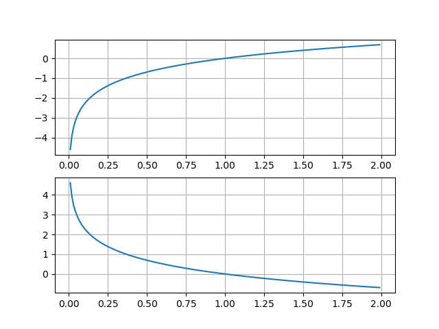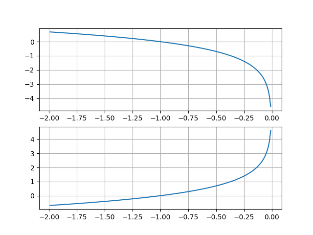

#### graph08 (Bar)
```python
men = (20, 35, 30, 35, 27)
women = (25, 32, 34, 20, 25)

index = np.arange(len(men))

plt.bar(index, men, 0.4)                                    # 0.4 막대 사이즈 # color 로 색 지정 가능
plt.bar(index+0.4, women, 0.4)
plt.xticks(index+0.2, ['A', 'B', 'C', 'D', 'E'])            # xticks 라벨링
plt.tight_layout()                                          # tight
plt.show()
```
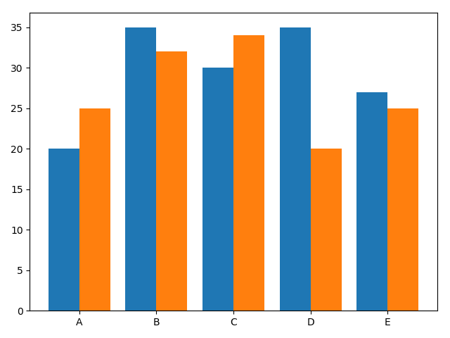

#### graph09
Data 파일을 이용하여 GDP TOP 10 막대 그래프 그리기
```python
f = open('Data/2016_GDP.txt', 'r', encoding='utf-8')
f.readline()                                                    # head 한 번 읽어서 제낌

names, money = [], []
for row in csv.reader(f, delimiter=':'):
    names.append(row[1])
    money.append(int(row[2].replace(',','')))                   # money 쉼표 제거 후, int 로 형변환
f.close()

# 한글 사용되는 font로 변경
path = 'C:\\Windows\Fonts\malgun.ttf'
font_name = font_manager.FontProperties(fname=path).get_name()
print(font_name)
rc('font', family=font_name)

# GDP top10 을 막대 그래프로 그려 보세요.
top10_country = names[:10]
index = np.arange(len(top10_country))

plt.bar(index, money[:10], color=colors.TABLEAU_COLORS)
plt.title('GDP TOP 10')

plt.xticks(index, top10_country, rotation=45)               # 막대 타이틀 45도로 기울기

# 나라 이름이 잘리지 않게 해주세요.
plt.subplots_adjust(bottom=0.2, top=0.9)
plt.show()
```
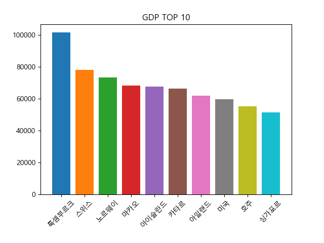