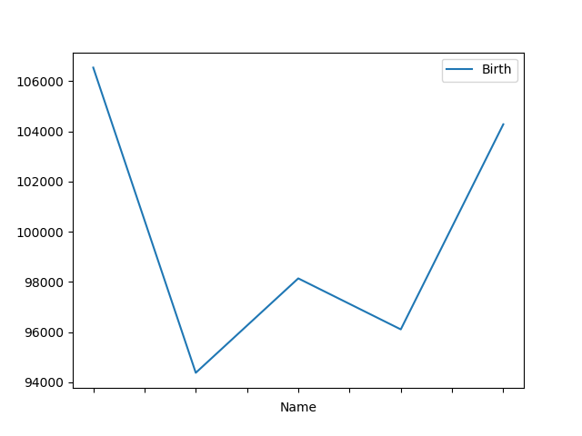
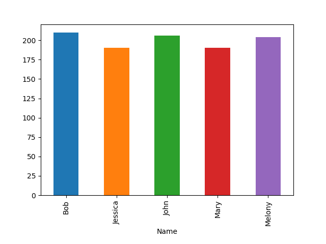

### Pandas
>Pandas("판다스"라고 읽는다) 패키지는 테이블 형태의 데이터를 다루기 위한 데이터프레임(DataFrame) 자료형을 제공한다. 자료의 탐색이나 정리에 아주 유용하여 데이터 분석에 빠질 수 없는 필수 패키지이다.
2008년도에 Wes McKinney에 의해 프로젝트가 시작되었다. 원래는 R 언어에서 제공하는 데이터프레임 자료형을 파이썬에서 제공할 수 있도록 하는 목적이었으나 다양한 기능이 추가되어 원래의 R 데이터프레임보다 능가하는 대규모 프로젝트가 되었다.-[데이터 사이언스 스쿨, 데이터 부석용 파이썬 패키지 소개](https://datascienceschool.net/view-notebook/b85212ea4040408e8ebd6d3495f2c91b/)

#### 개요

```python
import numpy as np
import matplotlib.pyplot as plt
import pandas as pd

s = pd.Series([5,1,2,9])
print(s)
                                                            # 0    5
                                                            # 1    1
                                                            # 2    2
                                                            # 3    9
                                                            # dtype: int64

print(s.values)                                             # [5 1 2 9]
print(s.index)                                              # RangeIndex(start=0, stop=4, step=1)
```

```python
s2 = pd.Series([5, 1, 2, 9], index = ['a', 'b', 'c', 'd'])
print(s2)

print(s2[0], s2[1], s2[2], s2[3])                           # 5 1 2 9
print(s2['a'], s2['b'])                                     # index 이름으로 접근 가능.
```

#### Comprehension
```python
print([i for i in range(5)])                                # 0~4 까지의 리스트 만들기
print([0 for i in range(5)])                                # 0 0 0 0 0
print(['test' for i in range(5)])                           # 'test' 'test' 'test' 'test' 'test'
```

#### dataframe

```python
np.random.seed(42)
baby_names = ['Bob', 'Jessica', 'Mary', 'John', 'Melony']

names = [baby_names[np.random.randint(len(baby_names))] for _ in range(1000)]
births = [np.random.randint(1000) for _ in range(1000)]

baby_sets = list(zip(names, births))

df = pd.DataFrame(baby_sets, columns=['Name', 'Birth'])
print(df)
print(type(df.values))                                      # <class 'numpy.ndarray'>
print(df.index)                                             # RangeIndex(start=0, stop=1000, step=1)
print(df.columns)                                           # Index(['Name', 'Birth'], dtype='object')

print(df.head(2))                                           # dataframe 의 head, default 5개, 갯수 지정 가능함.
print(df.tail(2))                                           # dataframe 의 tail, default 5개, 갯수 지정 가능함.
```

#### groupby()
dataframe 에서 column 별로 그룹핑이 가능하다.
```python
name_by = df.groupby('Name')
print(name_by)                                              # <pandas.core.groupby.DataFrameGroupBy object at 0x00000000034FE9E8>
print(name_by.sum())                                        # 이름별로 sum()
print(name_by.size())                                       # 이름별로 size()->갯수
print(name_by.size().sum())                                 # 1000```
````

#### name_by.sum().plot()


#### name_by.size().plot(kind='bar')
